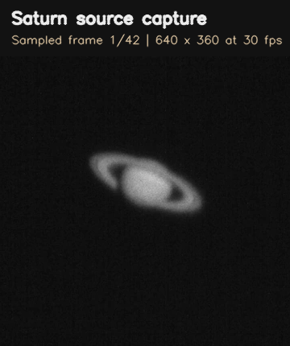
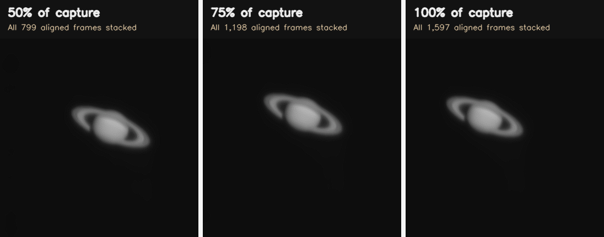
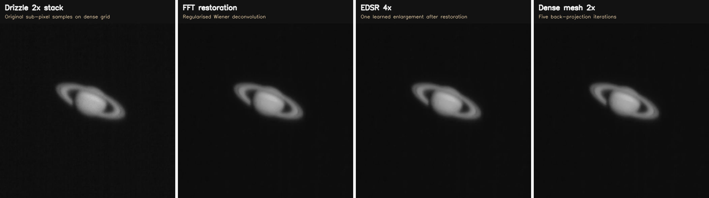
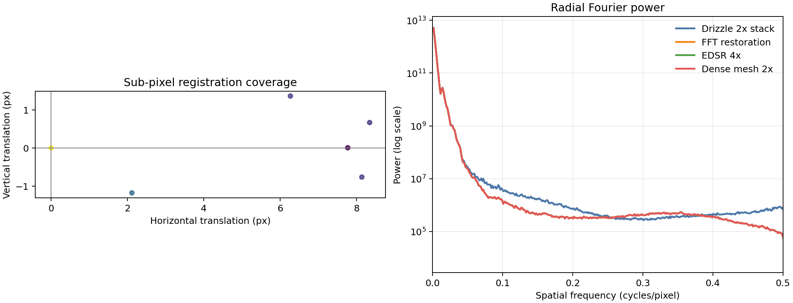

# Non-Rigid Dense Lucky Imaging

An experimental planetary-image and video reconstruction pipeline for
stabilising, stacking and restoring planetary captures. The current
documentation uses only a real local Saturn sequence; synthetic demonstrations
and their metrics have been removed.

## Real Capture Result

Source: a 53.2-second Saturn video at 640 x 360 pixels and 30 fps, containing
1,597 frames. The animation below samples the actual source sequence before
registration. It shows the capture noise, seeing variation and motion that the
pipeline is designed to correct.



The reconstruction below uses every frame in progressively longer temporal
spans. Each span is fully aligned before stacking; no frame is discarded by the
lucky-imaging selection in this evaluation (`--keep 1.0`). Sigma clipping still
rejects pixel-level outliers such as transient noise.



| Capture span | Decoded and aligned frames | Frames stacked | Output |
|---|---:|---:|---|
| First 50% | 799 | 799 | `output/evaluation/first_50_percent/saturn_final.png` |
| First 75% | 1,198 | 1,198 | `output/evaluation/first_75_percent/saturn_final.png` |
| Full capture | 1,597 | 1,597 | `output/saturn/saturn_final.png` |

## Processing Pipeline

1. **Decode and crop**: OpenCV decodes the local video. A bright-component
   detector identifies Saturn and produces a generous square region of interest.
2. **Object-centred global alignment**: Each native-resolution frame is
   centred from the planetary centroid, then refined using masked phase
   correlation and ECC translation registration. The mask prevents the black
   background from dominating alignment.
3. **Native non-rigid correction**: enabled by default, dense optical flow is
   estimated on the original sampling grid and each corrected frame is resampled
   once onto the reference grid.
4. **Lucky imaging after correction**: quality scores are computed on corrected
   planetary frames. By default, `--keep 1.0` retains every frame; lower values
   are available for controlled experiments.
5. **Drizzle reconstruction**: original frame samples are splatted onto a
   $2\times$ dense reference grid using their measured sub-pixel translations
   and accepted non-rigid fields. This is the default temporal super-resolution
   step, and writes auditable coverage statistics.
6. **Restoration**: denoising and a regularised Wiener FFT inverse restore the
   drizzle stack.
7. **Post-stack enlargement**: EDSR is applied once to the restored stack,
   followed by optional dense-mesh back-projection.

Applying optical flow before the stack is intentional: atmospheric deformation
is an inter-frame effect. After stacking, the individual displacement fields
have been mixed and cannot be inferred reliably from one image. EDSR is also
placed after stacking because frame-wise learned enlargement can make its
own inconsistent texture appear to be motion for the flow estimator.

### Mathematical Model

For frame $I_k$, global registration supplies a translation $t_k$ and native
non-rigid registration estimates a dense displacement field $u_k$. The corrected
frame sampled on the reference grid is:

$$
C_k(x) = I_k\left(x + t_k + u_k(x)\right).
$$

For the native-grid fallback, the robust weighted stack is formed as:

$$
S(x) = \frac{\sum_k w_k\,m_k(x)\,C_k(x)}
              {\sum_k w_k\,m_k(x) + \epsilon},
$$

where $w_k > 0$ is the quality-derived frame weight and $m_k(x)$ is the
sigma-clipping inlier mask. The default drizzle implementation below replaces
this native-grid fallback with direct deposition of original samples. With a
Gaussian PSF transfer function $H(f)$, the regularised Wiener restoration is:

$$
\hat{S}(f) = \frac{H^*(f)}{|H(f)|^2 + \lambda}\,\mathcal{F}\{S\}(f).
$$

Only after this operation does EDSR enlarge $\hat{S}$; it never contributes
synthetic per-frame detail to the non-rigid motion estimate.

### Drizzle Reconstruction

The default drizzle scale is $s=2$. For every observed source pixel $p$ in
frame $k$, the global translation $t_k$ and accepted flow $u_k$ map it onto the
dense reference mesh approximately as:

$$
q_k(p) = s\left(p + t_k - u_k(p+t_k)\right).
$$

The measured intensity is deposited by a bilinear footprint $b$ rather than by
resizing an already averaged image:

$$
D(q) = \frac{\sum_{k,p} w_k\,I_k(p)\,b\left(q-q_k(p)\right)}
              {\sum_{k,p} w_k\,b\left(q-q_k(p)\right)+\epsilon}.
$$

This is the key difference between drizzle and the optional final dense mesh:
drizzle uses independent samples from the original video before restoration.
The file `drizzle.csv` reports dense-grid coverage and mean weighted samples per
covered pixel. High coverage alone is not proof of resolution gain; the
Fourier diagnostic and the effective per-pixel redundancy must also support it.

## Super-Resolution and Dense Mesh Reconstruction

The optional high-resolution chain is ordered deliberately:

1. **Drizzle stack**: geometry-corrected original samples are deposited on a
   dense grid before frames are mixed.
2. **FFT restoration**: the drizzle stack is denoised and deconvolved on its observed
   sampling grid.
3. **EDSR 4x**: OpenCV's learned model enlarges the single restored stack.
4. **Dense mesh back-projection**: `--mesh-scale 2` builds a second, denser
   pixel lattice from the EDSR output. It repeatedly projects that lattice to
   the observed grid, and feeds the residual back to its vertices.

This is a data-consistency reconstruction, not a guarantee that new planetary
features exist. The mesh stage is deliberately optional: inspect its spectrum
and ringing before using it for measurement or scientific claims.





The left diagnostic plots measured sub-pixel translations; broad two-dimensional
coverage is evidence that multiple frames sample different parts of the dense
mesh. The right plot shows radial Fourier power on a logarithmic scale. A useful
restoration extends coherent high-frequency power without isolated spikes or a
large high-frequency pedestal, both of which indicate sharpening artefacts.

The checked-in mesh example is intentionally a bounded six-frame diagnostic so
that the complete CPU pipeline is reproducible. Its spectrum exhibits a visible
mid-frequency rise after dense-mesh reconstruction, so it is presented as an
artefact-detection example rather than evidence of new resolvable Saturn detail.
For a scientific result, use substantially more frames and retain the mesh stage
only when its diagnostic has no such unsupported spectral rise.

Run the complete optional chain as follows:

```bash
python main.py --video "input/saturn.mp4" --output output/saturn_mesh \
   --drizzle-scale 2 --superres-scale 4 --mesh-scale 2 --mesh-iterations 5
```

## Installation

Python 3.9 or newer is required.

```bash
pip install -r requirements.txt
```

## Run a Reconstruction

Pass a locally available video to the command-line entry point:

```bash
python main.py --video "input/saturn.mp4" --output output/saturn
```

This uses all aligned frames. It creates:

| File | Description |
|---|---|
| `reference.png` | Highest-scoring raw frame used as the registration reference |
| `stack_linear.png` | Drizzle reconstruction from original sub-pixel frame samples |
| `drizzle.csv` | Dense-grid coverage and mean weighted sample redundancy |
| `stack_restored.png` | FFT-restored drizzle image before optional dense-mesh reconstruction |
| `stack_superres.png` | EDSR enlargement of the FFT-restored stack |
| `saturn_final.png` | Final image; includes dense-mesh reconstruction when `--mesh-scale` is greater than 1 |
| `registration.csv` | Per-frame translation and phase/ECC registration diagnostics |

To run a deliberate lucky-imaging cut after alignment, specify a lower
fraction explicitly:

```bash
python main.py --video "input/saturn.mp4" --output output/saturn_lucky --keep 0.25
```

To disable drizzle and retain the native sampling grid, pass `--drizzle-scale 1`.

To disable the default native non-rigid correction for an ablation experiment:

```bash
python main.py --video "input/saturn.mp4" --output output/saturn_global --no-nonrigid
```

For a single planetary still, use the same restoration path without temporal
registration or stacking:

```bash
python main.py --image "input/planet.png" --output output/planet
```

## Reproduce README Assets

After reconstructing the full, partial and mesh-processing runs, regenerate
the README GIF, comparisons and diagnostic plots with:

```bash
python generate_readme_assets.py
```

The script reads `input/saturn.mp4`, the two partial outputs under
`output/evaluation/`, and the full output under `output/saturn/`, then writes
the versioned documentation assets to `docs/assets/`.

## Project Structure

```text
main.py                     Command-line entry point
video_pipeline.py           Registration, lucky imaging, stacking and restoration
generate_readme_assets.py   Real-capture GIF and comparison generator
optical_flow.py             Optional dense optical-flow refinement
warping.py                  Optical-flow remapping utility
input/saturn.mp4            Local Saturn source capture
output/                     Generated reconstruction results
docs/assets/                README GIF and comparison image
```