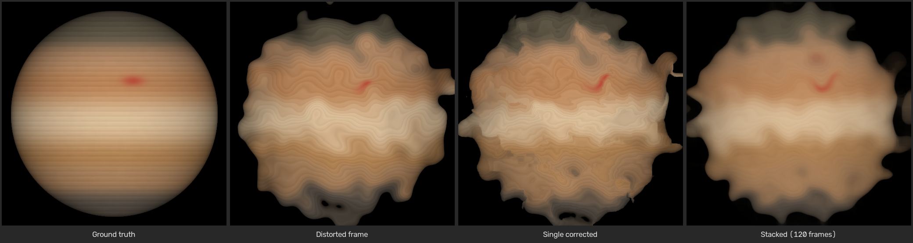

# nonrigid-dense-lucky-imaging

A computational astronomy framework for removing atmospheric turbulence from planetary video sequences.  
It surpasses classical shift-and-add methods by using **dense optical flow** and **non-rigid elastic warping** to align frames at the sub-pixel level before stacking.

---

## Table of Contents

- [Overview](#overview)
- [How it works](#how-it-works)
- [Installation](#installation)
- [Usage](#usage)
  - [Run the demo pipeline](#run-the-demo-pipeline)
  - [Run the benchmark](#run-the-benchmark)
- [Performance results (synthetic planetary data)](#performance-results-synthetic-planetary-data)
  - [Visual comparison](#visual-comparison)
  - [Quantitative metrics](#quantitative-metrics)
- [Configuration](#configuration)
- [Project structure](#project-structure)

---

## Overview

High-resolution planetary imaging from the ground is degraded by **atmospheric seeing**: the random, time-varying refractive index fluctuations in the atmosphere cause each video frame to appear blurred and geometrically distorted in a non-uniform way.

Classical *lucky imaging* selects only the sharpest frames from a video burst, but still discards most of the signal. This project goes further:

1. Every frame is **non-rigidly corrected** back to the geometry of the reference (sharpest) frame using dense optical flow.
2. All corrected frames are **stacked** (averaged), recovering signal-to-noise impossible to achieve from a single frame.

The result is a final image that is both geometrically accurate and much deeper than anything a single lucky frame can provide.

---

## How it works

```
Video burst (N frames)
        │
        ▼
┌─────────────────────────┐
│  Quality estimation     │  ← Laplacian-variance sharpness score per frame
│  → select reference     │
└────────────┬────────────┘
             │ reference frame
             ▼
┌─────────────────────────┐
│  Dense optical flow     │  ← DIS optical flow (OpenCV) for each frame
│  (per-frame)            │
└────────────┬────────────┘
             │ flow field (H × W × 2)
             ▼
┌─────────────────────────┐
│  Inverse warping        │  ← Lanczos backward remap cancels turbulence
└────────────┬────────────┘
             │ corrected frames
             ▼
┌─────────────────────────┐
│  Stack average          │  ← Mean of all corrected frames → final image
└─────────────────────────┘
```

### Key design choices

| Component | Method | Why |
|---|---|---|
| Sharpness metric | Variance of Laplacian | Simple, fast, excellent discriminator for blur |
| Optical flow | DIS (Dense Inverse Search) | Sub-pixel accuracy, 20+ fps on CPU for 512²  |
| Interpolation | Lanczos-4 | Minimal ringing artefacts when resampling fine texture |
| Stacking | Mean of all corrected frames | SNR grows as √N; geometry errors are averaged out |

---

## Installation

Requires Python ≥ 3.9.

```bash
pip install -r requirements.txt
```

`requirements.txt`:

```
opencv-python
numpy
scipy
```

---

## Usage

### Run the demo pipeline

```bash
python main.py
```

This:
1. Generates 120 synthetic 512×512 planetary frames with elastic turbulence deformation.
2. Selects the sharpest frame as reference.
3. Computes dense optical flow from the reference to every other frame.
4. Warps and saves each corrected frame.

Output folders:

| Folder | Contents |
|---|---|
| `output/1_distorted/` | Raw turbulence-distorted frames |
| `output/2_reference/` | The selected reference (sharpest) frame |
| `output/3_corrected/` | Non-rigidly corrected frames |

### Run the benchmark

```bash
python benchmark.py
```

Runs the full pipeline and prints PSNR, SSIM, and sharpness metrics (distorted vs corrected vs stacked average).  
You can override the number of frames:

```bash
NUM_IMAGES=80 python benchmark.py
```

---

## Performance results (synthetic planetary data)

All benchmarks were run on a synthetic 512×512 Jupiter-like gas-giant sequence (120 frames, elastic turbulence α = 1200, σ = 15).  
The *ground truth* is the undeformed base image used to generate the sequence.

### Visual comparison

The four columns below are *(left to right)*: **ground truth → distorted frame → single corrected frame → stacked average**.



The stacked average (rightmost) recovers fine surface banding and storm detail invisible in any individual turbulent frame.

### Quantitative metrics

| Metric | Distorted frames | Single corrected frame | **Stacked average (120 frames)** |
|---|---|---|---|
| PSNR (dB) ↑ | 22.48 | 21.78 | **22.99** |
| SSIM ↑ | 0.9533 | 0.9461 | **0.9588** |
| Sharpness (Laplacian var.) ↑ | 21.0 | 36.1 | — |

> **PSNR gain vs distorted:** +0.51 dB (stacked average)  
> **SSIM gain vs distorted:** +0.0055 (stacked average)

#### Throughput

| Resolution | Frames | Correction time | **FPS** |
|---|---|---|---|
| 512 × 512 | 119 | 4.35 s | **≈ 27 fps** |

> Tested on a single CPU core (no GPU). DIS optical flow is the bottleneck; throughput scales linearly with frame count.

---

## Configuration

All tunable parameters live in `config.py`:

| Parameter | Default | Description |
|---|---|---|
| `WIDTH` / `HEIGHT` | 512 | Frame dimensions in pixels |
| `NUM_IMAGES` | 120 | Number of frames to generate / process |
| `ELASTIC_ALPHA` | 1200.0 | Turbulence displacement amplitude |
| `ELASTIC_SIGMA` | 15.0 | Turbulence smoothness (Gaussian σ in pixels) |
| `OPTICAL_FLOW_PRESET` | `PRESET_MEDIUM` | DIS accuracy/speed trade-off |

Available `OPTICAL_FLOW_PRESET` values (from `cv2`):

- `cv2.DISOPTICAL_FLOW_PRESET_ULTRAFAST` — fastest, lower accuracy
- `cv2.DISOPTICAL_FLOW_PRESET_FAST`
- `cv2.DISOPTICAL_FLOW_PRESET_MEDIUM` ← default

---

## Project structure

```
.
├── main.py              # Demo pipeline entrypoint
├── benchmark.py         # Performance benchmark with PSNR / SSIM metrics
├── config.py            # Global constants
├── synthetic_data.py    # Synthetic planet generator + elastic deformation
├── quality_estimator.py # Laplacian sharpness metric & reference-frame selector
├── optical_flow.py      # DIS dense optical flow wrapper
├── warping.py           # Backward remap (inverse warping)
├── requirements.txt
└── output/
    ├── 1_distorted/     # Generated by main.py
    ├── 2_reference/
    ├── 3_corrected/
    ├── benchmark/       # Generated by benchmark.py
└── docs/
    └── assets/          # Images used in this README
```
