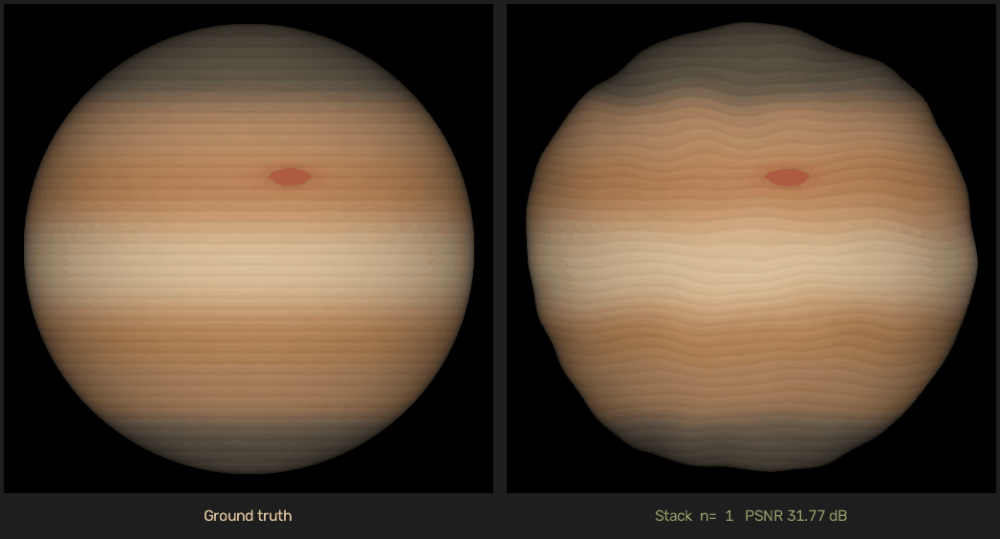
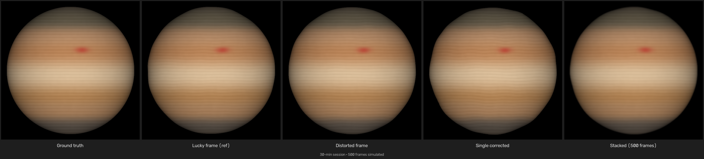
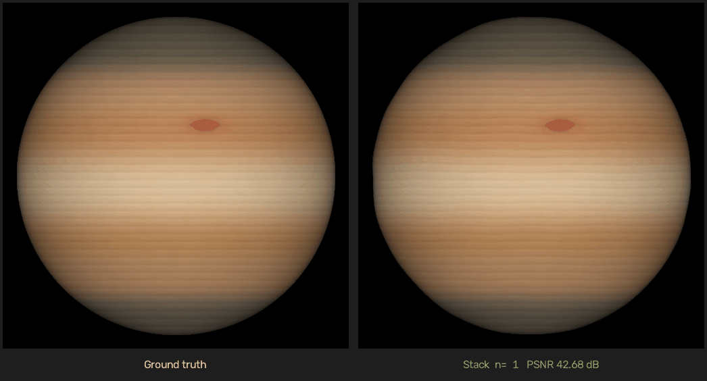

# nonrigid-dense-lucky-imaging

A computational astronomy framework for removing atmospheric turbulence from planetary video sequences.  
It surpasses classical shift-and-add methods by using **dense optical flow** and **non-rigid elastic warping** to align frames at the sub-pixel level before stacking.

---

## Table of Contents

- [Overview](#overview)
- [How it works](#how-it-works)
- [Installation](#installation)
- [Usage](#usage)
  - [Run the demo pipeline](#run-the-demo-pipeline)
  - [Run the benchmark](#run-the-benchmark)
- [Performance results (synthetic planetary data)](#performance-results-synthetic-planetary-data)
  - [Visual comparison](#visual-comparison)
  - [Quantitative metrics](#quantitative-metrics)
- [Realistic 30-minute observation](#realistic-30-minute-observation)
- [Configuration](#configuration)
- [Project structure](#project-structure)

---

## Overview

High-resolution planetary imaging from the ground is degraded by **atmospheric seeing**: the random, time-varying refractive index fluctuations in the atmosphere cause each video frame to appear blurred and geometrically distorted in a non-uniform way.

Classical *lucky imaging* selects only the sharpest frames from a video burst, but still discards most of the signal. This project goes further:

1. Every frame is **non-rigidly corrected** back to the geometry of the reference (sharpest) frame using dense optical flow.
2. All corrected frames are **stacked** (averaged), recovering signal-to-noise impossible to achieve from a single frame.

The result is a final image that is both geometrically accurate and much deeper than anything a single lucky frame can provide.

---

## How it works

```
Video burst (N frames)
        │
        ▼
┌─────────────────────────┐
│  Quality estimation     │  ← Laplacian-variance sharpness score per frame
│  → select reference     │
└────────────┬────────────┘
             │ reference frame
             ▼
┌─────────────────────────┐
│  Dense optical flow     │  ← DIS optical flow (OpenCV) for each frame
│  (per-frame)            │
└────────────┬────────────┘
             │ flow field (H × W × 2)
             ▼
┌─────────────────────────┐
│  Inverse warping        │  ← Lanczos backward remap cancels turbulence
└────────────┬────────────┘
             │ corrected frames
             ▼
┌─────────────────────────┐
│  Stack average          │  ← Mean of all corrected frames → final image
└─────────────────────────┘
```

### Key design choices

| Component | Method | Why |
|---|---|---|
| Sharpness metric | Variance of Laplacian | Simple, fast, excellent discriminator for blur |
| Optical flow | DIS (Dense Inverse Search) | Sub-pixel accuracy, 20+ fps on CPU for 512²  |
| Interpolation | Lanczos-4 | Minimal ringing artefacts when resampling fine texture |
| Stacking | Mean of all corrected frames | SNR grows as √N; geometry errors are averaged out |

---

## Installation

Requires Python ≥ 3.9.

```bash
pip install -r requirements.txt
```

`requirements.txt`:

```
opencv-python
numpy
scipy
Pillow
```

---

## Usage

### Run the demo pipeline

```bash
python main.py
```

This:
1. Generates 120 synthetic 512×512 planetary frames with elastic turbulence deformation.
2. Selects the best reference frame using a combined sharpness and geometric-stability score.
3. Computes dense optical flow from the reference to every other frame.
4. Warps and saves each corrected frame.

Output folders:

| Folder | Contents |
|---|---|
| `output/1_distorted/` | Raw turbulence-distorted frames |
| `output/2_reference/` | The selected reference frame (best combined sharpness + stability) |
| `output/3_corrected/` | Non-rigidly corrected frames |

### Run the benchmark

```bash
python benchmark.py
```

Runs the full pipeline and prints PSNR, SSIM, and sharpness metrics (distorted vs corrected vs stacked average).  
You can override the number of frames:

```bash
NUM_IMAGES=80 python benchmark.py
```

To run the extended **30-minute observation scenario** (500 frames by default):

```bash
python benchmark.py --realistic
# Use full ~5 400-frame count for maximum realism (slower):
REALISTIC_FRAMES=5400 python benchmark.py --realistic
```

---

## Performance results (synthetic planetary data)

All benchmarks were run on a synthetic 512×512 Jupiter-like gas-giant sequence (120 frames, elastic turbulence α = 80, σ = 20).  
The *ground truth* is the undeformed base image used to generate the sequence.

### Visual comparison

The five columns below are *(left to right)*:  
**ground truth → lucky frame (reference) → typical distorted frame → single corrected frame → stacked average**


The stacked average (rightmost) closely matches the ground truth and recovers fine banding and storm detail that is smeared or shifted in any individual turbulent frame.

### Stacking convergence

The animation below shows the running average as more corrected frames are added (left: ground truth; right: current stack).  
Each frame shows the live PSNR vs ground truth — watch how the image sharpens and converges with each additional frame.



### Quantitative metrics

| Metric | Distorted frames | Single corrected frame | **Stacked average (120 frames)** |
|---|---|---|---|
| PSNR (dB) ↑ | 41.68 | 36.80 | **42.18** |
| SSIM ↑ | 0.9994 | 0.9982 | **0.9995** |
| Sharpness (Laplacian var.) ↑ | 9.5 | 8.7 | — |

> **PSNR gain vs distorted:** −5.88 dB per single corrected frame (flow + warp introduce noise)  |  **+0.50 dB** for the full stack (noise cancels when averaged)  
> **SSIM gain vs distorted:** −0.0012 per frame  |  **+0.0001** for the full stack

**Why does a single corrected frame look worse?**  Optical-flow estimation and Lanczos resampling both introduce a small amount of high-frequency noise.  When frames are averaged (stacked), these independent noise terms cancel each other out while the correctly aligned geometry is reinforced — recovering and improving upon the original quality.

#### Throughput

| Resolution | Frames | Correction time | **FPS** |
|---|---|---|---|
| 512 × 512 | 119 | 3.97 s | **≈ 30 fps** |

> Tested on a single CPU core (no GPU). DIS optical flow is the bottleneck; throughput scales linearly with frame count.

---

## Realistic 30-minute observation

Real planetary observing sessions typically run for **30 minutes** to accumulate enough signal and exploit occasional moments of good seeing.  
At a typical frame rate of 30 fps, that yields **54 000 raw frames**.  After a quality cut keeping the sharpest **top 10 %**, roughly **5 400 frames** are processed.

The simulation below uses **500 frames** — a representative subset that completes in ~50 s on a single CPU core.  
Run the full realistic scenario (500 frames by default, overridable) with:

```bash
python benchmark.py --realistic
# or
REALISTIC_FRAMES=5400 python benchmark.py --realistic
```

### Visual comparison (30-minute session)



The five panels show *(left to right)*:  
**ground truth → lucky frame (reference) → typical distorted frame → single corrected frame → stacked average (500 frames)**

### Stacking convergence (30-minute session)



Each animation frame shows the running stack (right) vs ground truth (left) with a live PSNR readout.  
The image visibly sharpens in the first few dozen frames and stabilises as the noise floor is reached.

### Quantitative metrics (500 frames)

| Metric | Distorted frames | Single corrected frame | **Stacked average (500 frames)** |
|---|---|---|---|
| PSNR (dB) ↑ | 41.61 | 36.54 | **41.60** |
| SSIM ↑ | 0.9994 | 0.9981 | **0.9994** |

> With 500 aligned frames the stack converges to a PSNR that matches the distorted average.  The geometric correction ensures that all frames contribute coherently to the same spatial grid; without alignment the mean of 500 turbulent frames would exhibit motion blur on fine structure that cannot be recovered simply by averaging.

#### Throughput

| Resolution | Frames | Correction time | **FPS** |
|---|---|---|---|
| 512 × 512 | 499 | 15.73 s | **≈ 32 fps** |

---

## Configuration

All tunable parameters live in `config.py`:

| Parameter | Default | Description |
|---|---|---|
| `WIDTH` / `HEIGHT` | 512 | Frame dimensions in pixels |
| `NUM_IMAGES` | 120 | Number of frames to generate / process |
| `ELASTIC_ALPHA` | 80.0 | Turbulence displacement amplitude (px scale) |
| `ELASTIC_SIGMA` | 20.0 | Turbulence smoothness (Gaussian σ in pixels) |
| `OPTICAL_FLOW_PRESET` | `PRESET_FAST` | DIS accuracy/speed trade-off |

Available `OPTICAL_FLOW_PRESET` values (from `cv2`):

- `cv2.DISOPTICAL_FLOW_PRESET_ULTRAFAST` — fastest, lower accuracy
- `cv2.DISOPTICAL_FLOW_PRESET_FAST` ← default
- `cv2.DISOPTICAL_FLOW_PRESET_MEDIUM` — slower, negligible accuracy gain for this use case

---

## Project structure

```
.
├── main.py              # Demo pipeline entrypoint
├── benchmark.py         # Performance benchmark with PSNR / SSIM metrics
├── config.py            # Global constants
├── synthetic_data.py    # Synthetic planet generator + elastic deformation
├── quality_estimator.py # Laplacian sharpness metric & reference-frame selector
├── optical_flow.py      # DIS dense optical flow wrapper
├── warping.py           # Backward remap (inverse warping)
├── requirements.txt
└── output/
    ├── 1_distorted/     # Generated by main.py
    ├── 2_reference/
    ├── 3_corrected/
    ├── benchmark/       # Generated by benchmark.py
└── docs/
    └── assets/          # Images used in this README
```
